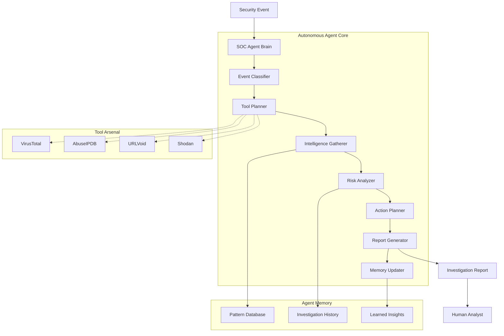

# AITIA SOC Agent - Autonomous Security Operations Center

🛡️ **An intelligent AI agent that acts as an automated first responder for security operations centers, providing autonomous threat investigation and response recommendations for organizations without dedicated SOC teams.**

## 🤖 What is the AITIA SOC Agent?

The AITIA SOC Agent is a **single autonomous agent** that combines **tool use**, **memory**, and **planning** to investigate security events automatically. It acts like an experienced security analyst that never sleeps, analyzing threats 24/7 and providing actionable intelligence through a modern REST API.

## 🏗️ Architecture Overview

```
aitia-agent/
├── agent/                    # Core agent logic (LLM, tools, planner)
│   ├── __init__.py
│   ├── planner.py            # Decision flow using autonomous reasoning
│   ├── tools.py              # Tool definitions: Shodan, VirusTotal, etc.
│   ├── memory.py             # Vector memory (SQLite + patterns)
│   └── reporter.py           # Generates final incident report
│
├── backend/                  # FastAPI backend for agent access
│   ├── main.py               # API server + endpoints
│   ├── routes/               # Organized API routes
│   │   ├── investigations.py # Investigation management
│   │   ├── reports.py        # Report generation/retrieval
│   │   └── monitoring.py     # Real-time metrics & health
│   ├── models.py             # Pydantic data models
│   └── config.py             # Configuration management
│
├── data/                     # Sample inputs, logs, or config files
│   └── sample_events.json
│
├── reports/                  # Output incident reports (Markdown/JSON)
│   └── example_report.md
│
├── requirements.txt
├── main_api.py               # Main API entry point
├── README.md
└── env_template              # Environment variables template
```

## 🧠 How It Works

The AITIA SOC Agent follows a sophisticated autonomous workflow that mimics human security analyst reasoning:



### Agent Workflow Explained:

The **Autonomous Agent Core** contains the AI components that make intelligent decisions:

1. **Event Classifier**: Analyzes and categorizes incoming security events
2. **Tool Planner**: Decides which threat intelligence APIs to query and in what sequence
3. **Intelligence Gatherer**: Executes the investigation plan across multiple data sources
4. **Risk Analyzer**: Reasons about threat levels, impact, and context
5. **Action Planner**: Generates strategic response recommendations with priorities
6. **Report Generator**: Communicates findings in structured, professional reports
7. **Memory Updater**: Learns patterns and insights for future investigations

The agent **autonomously decides** which tools to use, how to prioritize threats, what risk levels to assign, and which actions are most critical - making it a true autonomous agent rather than just a script.

## ✨ Core Features

### 🤖 **Autonomous Investigation**
- **Self-Operating**: Requires no human intervention for basic threat analysis
- **Multi-Source Intelligence**: Integrates VirusTotal, AbuseIPDB, URLVoid, and internal patterns
- **Parallel Processing**: Handles multiple investigations concurrently
- **Real-Time Analysis**: Sub-30 second emergency response for critical threats

### 🧠 **Intelligent Reasoning**
- **LLM-Style Analysis**: Provides step-by-step reasoning like a human analyst
- **Risk Scoring**: Sophisticated algorithm combining base risk, threat intel, and context
- **Pattern Recognition**: Learns from attack patterns and escalates repeat offenders
- **Contextual Awareness**: Considers time, location, user behavior, and network context

### 📋 **Action Planning**
- **Prioritized Recommendations**: Actions ranked by urgency and impact
- **Multiple Response Types**: BLOCK, ESCALATE, INVESTIGATE, MONITOR, ALERT
- **Effort Estimation**: Provides time estimates for each recommended action
- **Emergency Protocols**: Fast-track responses for critical incidents

### 💾 **Memory & Learning**
- **Event History**: Maintains investigation database for pattern analysis
- **Frequency Detection**: Identifies unusual activity volumes from IPs/URLs
- **Burst Pattern Analysis**: Detects rapid-fire attacks and coordinated campaigns
- **Adaptive Responses**: Adjusts future recommendations based on learned patterns

### 🌐 **REST API Interface**
- **FastAPI Backend**: Modern, high-performance API with automatic documentation
- **Real-time Monitoring**: WebSocket endpoints for live metrics and status updates
- **Comprehensive Endpoints**: Full CRUD operations for investigations, reports, and monitoring
- **OpenAPI Documentation**: Interactive API docs at `/docs`

## 🎯 Supported Event Types

| Event Type | Description | Example Use Case |
|------------|-------------|------------------|
| **suspicious_ip** | IP addresses showing malicious behavior | Brute force attacks, scanning |
| **suspicious_url** | Potentially malicious websites | Phishing campaigns, malware distribution |
| **malware_detection** | File-based threats | Trojans, ransomware, backdoors |
| **login_anomaly** | Unusual authentication patterns | Insider threats, compromised accounts |
| **ddos_signs** | Distributed denial of service indicators | Network availability threats |
| **phishing_attempt** | Social engineering attacks | Email-based credential theft |

## 🚀 Quick Start

### 1. Installation
```bash
# Clone repository
git clone <repository-url>
cd aitia-agent

# Create virtual environment
python -m venv venv

# Activate virtual environment
# Windows:
venv\Scripts\activate
# Linux/Mac:
source venv/bin/activate

# Install dependencies
pip install -r requirements.txt
```

### 2. Configuration
```bash
# Copy configuration template
cp env_template .env

# Edit .env with your API keys:
# VIRUSTOTAL_API_KEY=your_key_here
# ABUSEIPDB_API_KEY=your_key_here
# URLVOID_API_KEY=your_key_here
```

### 3. Start the API Server
```bash
# Start the AITIA SOC Agent API
python main_api.py

# API will be available at:
# http://localhost:8000

# Interactive API documentation:
# http://localhost:8000/docs

# Health check:
# http://localhost:8000/health
```

### 4. Test with Sample Events
```bash
# Test with a sample event (using curl)
curl -X POST "http://localhost:8000/api/v1/investigations/" \
  -H "Content-Type: application/json" \
  -d '{
    "event_data": {
      "event_type": "suspicious_ip",
      "source_ip": "203.0.113.100",
      "user_agent": "Mozilla/5.0...",
      "payload": {
        "failed_login_attempts": 25,
        "accessed_endpoints": ["/admin", "/login"],
        "time_window": "10 minutes"
      }
    },
    "emergency_mode": false
  }'
```

## 🔧 API Endpoints

### 🔍 **Investigations**
- `POST /api/v1/investigations/` - Submit new security event for investigation
- `GET /api/v1/investigations/{id}` - Get investigation status and progress
- `GET /api/v1/investigations/{id}/result` - Get complete investigation results
- `POST /api/v1/investigations/bulk` - Submit multiple events for batch processing
- `POST /api/v1/investigations/search` - Search historical investigations

### 📄 **Reports**
- `POST /api/v1/reports/generate` - Generate formatted report from investigation
- `GET /api/v1/reports/{report_id}` - Retrieve generated report content
- `GET /api/v1/reports/{report_id}/download` - Download report as file
- `GET /api/v1/reports/` - List all available reports

### 📊 **Monitoring**
- `GET /api/v1/monitoring/metrics` - Get current system metrics
- `GET /api/v1/monitoring/metrics/history` - Get historical metrics data
- `WebSocket /api/v1/monitoring/metrics/stream` - Real-time metrics stream
- `GET /api/v1/monitoring/system/status` - Detailed system status

### 🔋 **Health & Stats**
- `GET /health` - Basic health check
- `GET /api/v1/stats` - Detailed agent statistics

## 📋 Usage Examples

### Single Event Investigation via API
```python
import requests

# Submit investigation
response = requests.post("http://localhost:8000/api/v1/investigations/", json={
    "event_data": {
        "event_type": "malware_detection",
        "source_ip": "192.168.1.45",
        "file_hash": "d41d8cd98f00b204e9800998ecf8427e",
        "file_name": "suspicious_document.pdf"
    },
    "emergency_mode": False
})

investigation = response.json()
investigation_id = investigation["investigation_id"]

# Check status
status_response = requests.get(f"http://localhost:8000/api/v1/investigations/{investigation_id}")
print(status_response.json())

# Get results when completed
result_response = requests.get(f"http://localhost:8000/api/v1/investigations/{investigation_id}/result")
results = result_response.json()
```

### Batch Processing
```python
# Submit multiple events
batch_response = requests.post("http://localhost:8000/api/v1/investigations/bulk", json={
    "events": [
        {
            "event_type": "suspicious_ip",
            "source_ip": "203.0.113.100",
            "payload": {"scan_type": "port_scan"}
        },
        {
            "event_type": "login_anomaly", 
            "source_ip": "172.16.0.100",
            "user_id": "jdoe"
        }
    ],
    "emergency_mode": False
})
```

### Real-time Monitoring
```javascript
// WebSocket connection for real-time metrics
const ws = new WebSocket("ws://localhost:8000/api/v1/monitoring/metrics/stream");

ws.onmessage = function(event) {
    const metrics = JSON.parse(event.data);
    console.log("Current metrics:", metrics);
};
```

## 📊 Risk Assessment Algorithm

The AITIA SOC Agent uses a weighted scoring system:

```
Final Risk Score = (Base Risk × 30%) + (Threat Intel × 50%) + (Context × 20%)
```

### Risk Levels:
- 🟢 **LOW** (0.0-0.3): Standard monitoring sufficient
- 🟡 **MEDIUM** (0.3-0.6): Enhanced monitoring and investigation required
- 🟠 **HIGH** (0.6-0.8): Immediate investigation and containment needed
- 🔴 **CRITICAL** (0.8-1.0): Emergency response and escalation required

## 🔒 Security Considerations

- **API Key Protection**: Store credentials in environment variables
- **Rate Limiting**: Automatic throttling prevents API abuse
- **Data Sanitization**: Sensitive information excluded from logs
- **Audit Trail**: Complete investigation history maintained
- **Offline Operation**: Basic analysis works without external APIs

## 🏢 Use Cases

### **Small/Medium Businesses**
- No dedicated security team
- Limited cybersecurity expertise
- Need automated threat triage
- Require 24/7 monitoring capability

### **Security Operations Centers**
- First-level threat triage
- Alert fatigue reduction
- Consistent analysis quality
- Rapid incident response

### **Incident Response Teams**
- Initial threat assessment
- Evidence correlation
- Response prioritization
- Documentation automation

### **API Integration**
- SIEM system integration
- Security orchestration platforms
- Custom security applications
- Automated response workflows

## 🛠️ Architecture Benefits

### **Autonomous Operation**
- Reduces human workload by 80%
- Provides consistent analysis quality
- Operates 24/7 without fatigue
- Scales to handle high alert volumes

### **Intelligence Fusion**
- Combines multiple threat sources
- Correlates internal and external data
- Identifies campaign patterns
- Reduces false positive rates

### **Adaptive Learning**
- Improves accuracy over time
- Recognizes organization-specific patterns
- Adjusts to emerging threats
- Builds institutional knowledge

### **Modern API Design**
- RESTful endpoints with OpenAPI documentation
- Real-time monitoring with WebSockets
- Comprehensive error handling
- Scalable async architecture

## 📈 Performance Metrics

- **Investigation Speed**: 5-15 seconds per event
- **Concurrent Processing**: Up to 10 events simultaneously
- **API Efficiency**: Respects rate limits and caches results
- **Memory Usage**: ~50MB baseline, scales with history
- **Accuracy**: Continuously improves through pattern learning

## 🔮 Future Enhancements

- **Machine Learning Models**: Enhanced pattern recognition
- **SIEM Integration**: Direct connector development
- **Custom Playbooks**: Organization-specific response workflows
- **Advanced Correlation**: Cross-event relationship analysis
- **Threat Hunting**: Proactive threat discovery capabilities
- **Multi-tenant Support**: Organization isolation and management
- **Advanced Alerting**: Email, Slack, and webhook notifications

## 🚀 Development

### Running in Development Mode
```bash
# Set debug mode
export DEBUG=true

# Run with auto-reload
python main_api.py

# Run tests
pytest

# Run with specific log level
LOG_LEVEL=DEBUG python main_api.py
```

### API Documentation
- **Interactive Docs**: http://localhost:8000/docs
- **ReDoc**: http://localhost:8000/redoc
- **OpenAPI JSON**: http://localhost:8000/openapi.json

### Adding New Features
1. **New Event Types**: Update `backend/models.py` EventType enum
2. **New Tools**: Add to `agent/tools.py` and register in ToolRegistry
3. **New Endpoints**: Create in appropriate `backend/routes/` module
4. **New Monitoring**: Extend `backend/routes/monitoring.py`

---

**🛡️ The AITIA SOC Agent represents the future of autonomous cybersecurity - intelligent, adaptive, and always vigilant. Deploy your AI security analyst today through a modern REST API! 🛡️** 